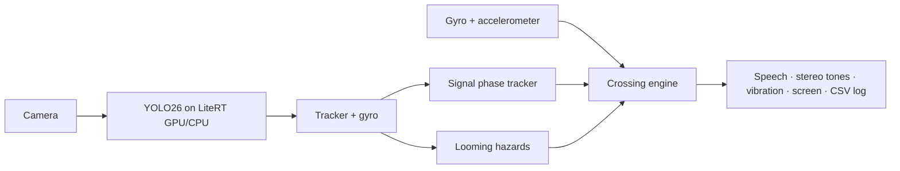

# CrossWise Android

This repository contains the React Native Android app. The source, screens,
voice commands, vehicle model and crossing logic are now checked
into this repository; it no longer depends on a symlink to the iOS checkout.
The former Kotlin/Compose implementation is retained in `android-legacy/` for
reference only.

## How it works

1. Stand at the kerb facing the road and press the one big Start button (or say "start").
2. Turn right until the phone points up the road, hold for 5 s, then turn round to the left, past the road, and hold.
3. Face the road. The phone says what the camera saw. It never says "safe".
4. Press "Check again", or "Cross" for step counts and warnings. Voice: start, check again, cross, stop, repeat, help.
5. Guides: [docs/HOW-TO-USE.md](docs/HOW-TO-USE.md) for users and trainers; [docs/KERB-TEST.md](docs/KERB-TEST.md) for the kerb test with a sighted helper.

The custom CrossWise model (crosswise.tflite: pedestrian signals, crosswalks, people and vehicles) is bundled and selected by default; the YOLO26n BDD100K vehicle model is also bundled and selectable in Developer mode. Detection does not establish that crossing is safe. Models and optical motion estimates still require outdoor evaluation.

## Build and run

JDK 17 and Android SDK 36 are required. Android 8+ is supported; on-device
voice requires Android 12+ and an installed recognizer.


```bash
npm install
npm run android                 # development build; Metro is required
npm run android:preview         # standalone ARM64 preview APK
npm test
npm run typecheck
npm run lint
```

For a standalone build, use `android/app/build/outputs/apk/release/` after the
preview script completes. Release builds embed the JavaScript bundle and do not
need Metro on the phone.

The separate package is labelled **CrossWise Preview**. It preserves the old CrossWise installation and its data. APK: `android/app/build/outputs/apk/debug/app-debug.apk`.

## Repository

- `android/`: React Native Android host and native adapters.
- `src/`: shared TypeScript app source.
- `assets/models/`: bundled YOLO vehicle models.
- `android-legacy/`: superseded Kotlin/Compose implementation.
- `ml/`: datasets, training and exports.
- `docs/`: research, plans and implementation records; older plans may describe superseded interfaces.

## Architecture in one picture



Details in [docs/DESIGN.md](docs/DESIGN.md).

## License notes

App code: choose a license for the capstone (AGPL-3.0 is simplest, because the Ultralytics YOLO models are AGPL-3.0).
LiteRT, CameraX, Compose: Apache-2.0. Datasets: see [ml/README.md](ml/README.md#licenses).
