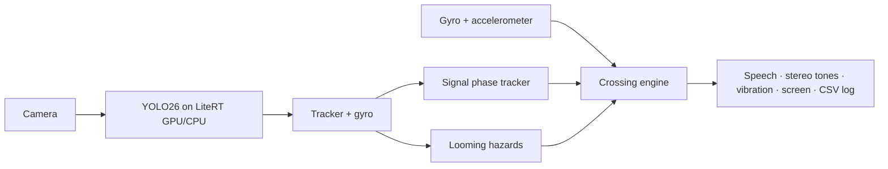

# CrossWise

**A phase-aware street-crossing assistant for blind and low-vision people, on Android, fully on-device.**

CrossWise watches a pedestrian signal *over time* and follows the traveler through the whole crossing:

1. **Aim** — a sonar tone speeds up and pans toward the signal until it is straight ahead; "Tilt the phone up" when needed.
2. **Wait** — "Don't walk sign." … "**Walk sign just came on.**" It tells a walk sign it *saw start* apart from one that was
   already on ("…may end soon"), and detects flashing clearance phases from their rhythm.
3. **Cross** — starting to walk switches to crossing mode automatically; the gyroscope locks the heading and "Bear left"
   plays from the correct ear if the user drifts. Vehicles whose image grows fast trigger "Vehicle approaching, left".
4. **Arrive** — standing still on the far side ends crossing mode.

It never says "safe to cross". It describes what it perceives; the traveler decides.

> ⚠️ Research prototype. Not a replacement for a cane, guide dog, orientation & mobility training or judgment.
> Do not test by crossing real streets blindfolded — see [docs/ROADMAP.md](docs/ROADMAP.md#safety-protocol-for-all-testing).

**Your to-do list (accounts, data requests, training runs, testing, report): [NEXT_STEPS.md](NEXT_STEPS.md).**

## Repository

| Path | What |
|---|---|
| [`NEXT_STEPS.md`](NEXT_STEPS.md) | Your checklist, week by week |
| [`android/`](android) | Android Studio project (Kotlin, Jetpack Compose, CameraX, LiteRT) |
| [`ml/`](ml) | Dataset building, training, LiteRT export, Kaggle runner |
| [`docs/RESEARCH.md`](docs/RESEARCH.md) | Survey of existing apps, papers, datasets; how CrossWise differs |
| [`docs/DESIGN.md`](docs/DESIGN.md) | Architecture, algorithms, feedback vocabulary, limitations |
| [`docs/ROADMAP.md`](docs/ROADMAP.md) | 4-week plan, what was cut and why, evaluation and safety protocol |

## Run the app

Requirements: Android Studio Narwhal 4 Feature Drop (2025.1.4) or newer, a phone with Android 8.0+ (a camera and
gyroscope; GPU recommended).

1. Open the `android/` folder in Android Studio and let Gradle sync (AGP 8.13, Kotlin 2.2, compileSdk 36).
2. Get a model — the app ships without one:
   * **Today, no training:** `cd ml && python scripts/kaggle_run.py run --mode smoke` runs the pipeline on Kaggle's
     free machines and brings back the COCO baseline `yolo26n.tflite` (vehicles + generic lights; colors announced as
     unverified) in about 15 minutes.
   * **Real model:** `python scripts/kaggle_run.py run --mode full --gpu` trains on pedestrian-signal data. No boxes are drawn by hand:
     labels come from VIDVIP, DTLD, Mapillary Vistas, ImVisible and Roboflow, plus auto-labeled videos that you only
     review with the A / F / R keys (see [ml/README.md](ml/README.md#where-the-labels-come-from)).
   * Then either copy it to `android/app/src/main/assets/models/crosswise.tflite` and rebuild, or on the phone use
     *Settings → Import .tflite model*.
3. Run on the phone. Accept the safety notice and camera permission, tap **Start assist**, point the phone across the street.

Four tabs: **Assist** (live), **Practice** (rehearse every sound, word and vibration indoors), **Guide** (safety,
cue legend, troubleshooting, session logs, licences) and **Settings**. Assist keeps running underneath the others.

Hands-free: while assist is on, **volume up** starts/ends crossing mode and **volume down** repeats the status.
Bone-conduction headphones make the left/right tones usable while keeping ears open to traffic.

Command line (from `android/`):

```bash
./gradlew assembleDebug        # APK in app/build/outputs/apk/debug
./gradlew testDebugUnitTest    # 45 JVM tests: signal phases, looming, veer, decoder, end-to-end scenario
./gradlew lintDebug
```

Tip: the project sits in a OneDrive folder. Build outputs are large; pause OneDrive sync while building, or keep build
outputs elsewhere with `./gradlew assembleDebug -Pcrosswise.buildRoot=C:/dev/crosswise-build`.

## Architecture in one picture



Details in [docs/DESIGN.md](docs/DESIGN.md).

## License notes

App code: choose a license for the capstone (AGPL-3.0 is simplest, because the Ultralytics YOLO models are AGPL-3.0).
LiteRT, CameraX, Compose: Apache-2.0. Datasets: see [ml/README.md](ml/README.md#licenses).
