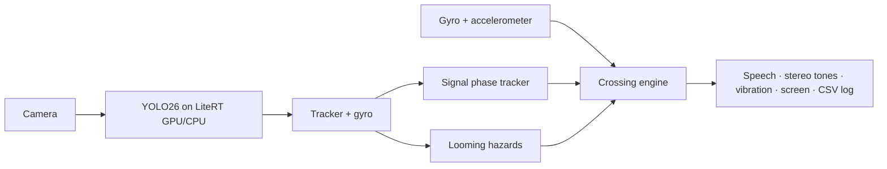

# CrossWise Android

This repository contains the React Native Android app. The source, screens,
navigation, voice commands, vehicle model and crossing logic are now checked
into this repository; it no longer depends on a symlink to the iOS checkout.
The former Kotlin/Compose implementation is retained in `android-legacy/` for
reference only.

## Current interface

- Full-screen camera. User mode has compact status and optional controls; Developer mode adds labelled boxes, counts and expandable diagnostics.
- The bottom arrow opens an interactive Google map. Its destination panel expands from the bottom; the bottom-right close icon returns to the camera.
- Place search, explicit result selection, walking-route review, saved-place stars, aliases, three recent saved places, remove and undo.
- Foreground GPS continues while a journey is paused. Route steps and far-footpath arrival require explicit confirmation; the app does not infer the pavement side from GPS.
- On-device voice commands: `manual`, `man`, `navigate to …`, `search …`, `first/second/third`, `save as …`, `confirm`, `repeat`, `pause`, `resume`, `stop navigation`. Offline English recognition must be available on the device.
- Settings contains mode selection, the manual, precautions, practice cues and developer controls. Volume keys retain normal volume behavior.

The custom CrossWise model (crosswise.tflite: pedestrian signals, crosswalks, people and vehicles) is bundled and selected by default; the YOLO26n BDD100K vehicle model is also bundled and selectable in Developer mode. Detection does not establish that crossing is safe. Models and optical motion estimates still require outdoor evaluation.

## Build and run

JDK 17 and Android SDK 36 are required. Android 8+ is supported; on-device
voice requires Android 12+ and an installed recognizer.

Build configuration reads `GOOGLE_MAP_API_KEY` and `GEMINI_API_KEY` from environment variables or this repository's local `.env` file. Keys are not entered on the phone. The Google project must enable Maps SDK for Android, Places API and Routes API; Android key restrictions must match the installed package and signing certificate. Keys compiled into a mobile app are not secrets and need provider restrictions.

```bash
npm install
npm run android                 # development build; Metro is required
npm run android:preview         # standalone ARM64 preview APK
npm test
npm run typecheck
npm run lint
```

For a standalone build, use `android/app/build/outputs/apk/release/` after the
preview script completes. Release builds embed the JavaScript bundle and do not
need Metro on the phone.

The separate package is labelled **CrossWise Preview**. It preserves the old CrossWise installation and its data. APK: `android/app/build/outputs/apk/debug/app-debug.apk`.

## Repository

- `android/`: React Native Android host and native adapters.
- `src/`: shared TypeScript app source.
- `assets/models/`: bundled YOLO vehicle models.
- `android-legacy/`: superseded Kotlin/Compose implementation.
- `ml/`: datasets, training and exports.
- `docs/`: research, plans and implementation records; older plans may describe superseded interfaces.

## Architecture in one picture



Details in [docs/DESIGN.md](docs/DESIGN.md).

## License notes

App code: choose a license for the capstone (AGPL-3.0 is simplest, because the Ultralytics YOLO models are AGPL-3.0).
LiteRT, CameraX, Compose: Apache-2.0. Datasets: see [ml/README.md](ml/README.md#licenses).
