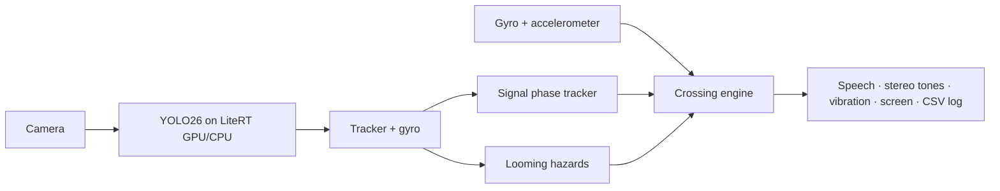

# CrossWise

Native Android implementation of the CrossWise camera-first design, ported from `../capstone_ios`.

## Current interface

- Full-screen camera. User mode has compact status and optional controls; Developer mode adds labelled boxes, counts and expandable diagnostics.
- The bottom arrow opens an interactive Google map. Its destination panel expands from the bottom; the bottom-right close icon returns to the camera.
- Place search, explicit result selection, walking-route review, saved-place stars, aliases, three recent saved places, remove and undo.
- Foreground GPS continues while a journey is paused. Route steps and far-footpath arrival require explicit confirmation; the app does not infer the pavement side from GPS.
- On-device voice commands: `manual`, `man`, `navigate to …`, `search …`, `first/second/third`, `save as …`, `confirm`, `repeat`, `pause`, `resume`, `stop navigation`. Offline English recognition must be available on the device.
- Settings contains mode selection, the manual, precautions, practice cues and developer controls. Volume keys retain normal volume behavior.

YOLO26n is bundled and selected by default; the custom CrossWise model is also bundled. Detection does not establish that crossing is safe. Models and optical motion estimates still require outdoor evaluation.

## Build and run

Open `android/` in Android Studio. JDK 17+, Android SDK 36 and Android 8+ are required; on-device voice requires Android 12+ and an installed recognizer.

Build configuration reads `GOOGLE_MAP_API_KEY` and `GEMINI_API_KEY` from environment variables or `../capstone_ios/.env` relative to this repository. Keys are not entered on the phone. The Google project must enable Maps SDK for Android, Places API and Routes API; Android key restrictions must match the installed package and signing certificate. Keys compiled into a mobile app are not secrets and need provider restrictions.

```bash
cd android
bash gradlew :app:assembleDebug :app:testDebugUnitTest :app:lintDebug
# Separate installation when the existing app has a different signing certificate:
bash gradlew -PcrosswiseApplicationId=com.crosswise.app.preview :app:assembleDebug
# Connected-device tests, using the same application ID:
bash gradlew -PcrosswiseApplicationId=com.crosswise.app.preview :app:connectedDebugAndroidTest
```

The separate package is labelled **CrossWise Preview**. It preserves the old CrossWise installation and its data. APK: `android/app/build/outputs/apk/debug/app-debug.apk`.

## Repository

- `android/`: Kotlin, Compose, CameraX and LiteRT app.
- `../capstone_ios/`: iOS app and source design.
- `ml/`: datasets, training and exports.
- `docs/`: research, plans and implementation records; older plans may describe superseded interfaces.

## Architecture in one picture



Details in [docs/DESIGN.md](docs/DESIGN.md).

## License notes

App code: choose a license for the capstone (AGPL-3.0 is simplest, because the Ultralytics YOLO models are AGPL-3.0).
LiteRT, CameraX, Compose: Apache-2.0. Datasets: see [ml/README.md](ml/README.md#licenses).
