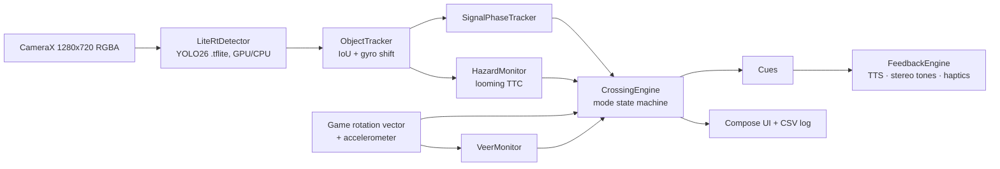
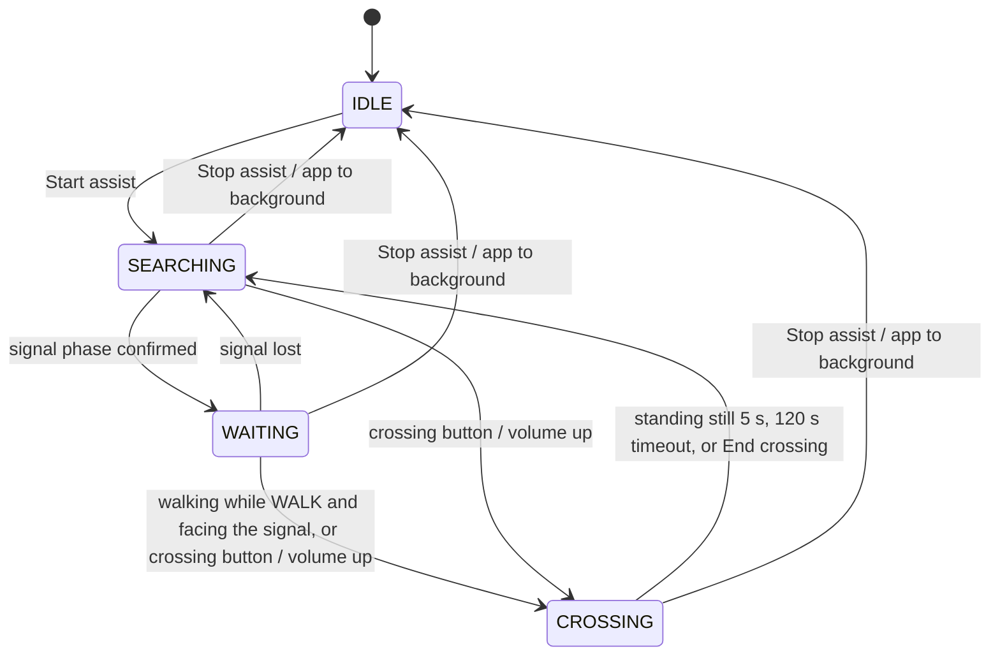

# CrossWise — design

## 1. Principles

1. **Describe, never decide.** The app reports what it perceives ("Walk sign just came on", "Vehicle approaching, left").
   It never says "safe to cross". The traveler's cane/dog skills and judgment stay in charge.
2. **A late WALK beats a false WALK.** Every threshold is asymmetric in favor of caution.
3. **Silence is information too, so avoid noise.** Speak only on change; continuous guidance uses short tones and vibration.
4. **On-device and offline.** No network needed at the curb; no images leave the phone.
5. **Honest uncertainty.** Heuristic results are announced as unverified; a lost signal is announced, not silently kept.

## 2. Architecture

Everything below the detector is plain Kotlin with no Android dependencies and is covered by JVM unit tests
(`android/app/src/test`).

| Package | Responsibility |
|---|---|
| `perception` | Model loading (metadata from the `.tflite`), letterboxing, decoding raw / NMS-free YOLO heads, label mapping, color heuristic for baseline models |
| `tracking` | Multi-object tracker; monocular time-to-contact |
| `signal` | Signal phase state machine |
| `crossing` | Mode state machine, aiming sonar, veer monitor, hazard monitor |
| `sensors` | Heading/pitch math, walking detection |
| `feedback` | Cue vocabulary, prioritized TTS, synthesized stereo earcons, haptic patterns |
| `camera`, `settings`, `logging`, `ui` | Android glue |

## 3. Model contract

The app accepts any Ultralytics detection model exported with `format="litert"` (or legacy `tflite`):

* **Input** `float32`, RGB in [0, 1], letterboxed with gray (114) padding; `[1,3,H,W]` (litert-torch) or `[1,H,W,3]` (onnx2tf) — detected from the shape.
* **Output** either NMS-free `[1, 300, 6]` = `x1,y1,x2,y2,score,class` (pixels) or raw `[1, 4+nc, anchors]` = `cx,cy,w,h` (normalized) + class scores. Units are detected automatically; raw heads get per-class NMS.
* **Class names** are read from the `metadata.json` that Ultralytics appends to the file as a zip entry, and mapped by name
  (`LabelMapper`), so retraining with more classes needs no app change. Canonical names: `ped_red, ped_green, crosswalk,
  person, bicycle, car, motorcycle, bus, truck`.
* If the model has no pedestrian-signal classes (e.g. plain COCO), generic `traffic light` boxes get a pixel color estimate
  and every announcement says the color is unverified.

GPU is tried first through the LiteRT `CompiledModel` API (warm-up output checked for NaNs), then the CPU Interpreter
(XNNPACK, 4 threads).

## 4. Signal phase tracking (`SignalPhaseTracker`)

1. **Primary signal**: among signal tracks seen in the last 300 ms, score = confidence × center weight × size weight × maturity.
   A new candidate replaces the current one only if 1.6× better. If it is near where the old one was (≤ 0.12 of the frame,
   after gyro compensation, within 3 s) it is treated as the same physical signal and history is kept.
2. **Evidence**: leaky integrators `e ← d·e + (1−d)·score`, `d = exp(−Δt/450 ms)`, so behavior does not depend on FPS.
3. **Candidate phase**: WALK if `e_walk ≥ 0.45` and `≥ 2 × e_dontwalk`; DON'T WALK if `e_dontwalk ≥ 0.35` and `≥ 2 × e_walk`.
4. **Asymmetric dwell**: WALK must persist 700 ms, DON'T WALK 300 ms. A 300 ms green blip during red never produces WALK
   (unit test `briefGreenBlipDuringRedIsIgnored`). Typical latency: WALK ≈ 1.2 s, DON'T WALK ≈ 0.8 s after the real change.
5. **Flashing**: over a 4 s window, run lengths of "detected / not detected". Flashing when ≥ 2 complete on-runs and ≥ 2 off-runs,
   all 180–1300 ms, each set with coefficient of variation ≤ 0.45. Random detector misses (single frames) or an occluding bus
   (one long gap) do not qualify.
6. **Fresh walk**: WALK is *fresh* only if DON'T WALK was confirmed for ≥ 1 s and the change was observed (gap ≤ 3 s, so a
   passing bus during red still counts). Otherwise: "Walk sign is on, but it may end soon."
7. **Lost** after 1.8 s without the primary signal. Mid-crossing losses are not announced (the far signal naturally leaves the view).

## 5. Vehicle hazards (`Looming`, `HazardMonitor`)

For an object approaching at constant speed, time to contact τ = size / (d size/dt) = 1 / (d ln size / dt) (optical "tau",
Lee 1976). A least-squares fit of ln(√(w·h)) over the last 1 s (≥ 4 samples, ≥ 350 ms) gives τ without depth or camera
calibration.

* Skip windows where the box touches the left/right/top border (growth there is the object entering the view); if the bottom
  is clipped, fit the width only.
* Alert if fit R² ≥ 0.6, height ≥ 5 % of the frame and τ ≤ 3 s (≤ 4 s while crossing); critical if τ ≤ 1.6 s.
* Vehicles moving across the view keep their size and are ignored (unit test `passingVehicleIsNotAHazard`).
* One announcement per frame (most urgent), repeated per vehicle at most every 3 s unless it escalates.

Known limit: a phone camera sees ~40° horizontally in portrait, so traffic from the sides is only visible when the user scans.

## 6. Heading, aiming and veering

* **Orientation**: `TYPE_GAME_ROTATION_VECTOR` (gyro + accelerometer, no magnetometer). Camera axis = device −Z in world
  coordinates → heading `atan2(east, north)` and pitch `asin(up)`. When the phone is nearly flat, heading comes from the
  top edge instead.
* **Gyro-compensated tracking**: between frames, image shift = (−Δheading / HFOV, Δpitch / VFOV), so a small signal head keeps
  its track while the user scans. HFOV/VFOV come from the camera's focal length and sensor size, corrected for the 16:9 crop.
* **Aiming sonar**: bearing to the target = `atan((x − 0.5) · 2 · tan(HFOV/2))`. Tick interval 900 ms at ≥ 25° → 180 ms at ≤ 4°,
  stereo-panned toward the target; a chime + tick after 600 ms centered. Sparse (only when > 10° off) while waiting.
* **Tilt hints**: pitch < −35° for 1.5 s → "Tilt the phone up"; a signal lost at the top edge → "Tilt the phone up".
* **Veer guard**: at crossing start, lock the circular mean heading of the last 1 s (a single reading can sit at a sway peak).
  Smooth with τ = 600 ms; drift ≥ 12° for 1 s → "Bear left/right" + earcon from the correct side + vibration; back within 6° → soft chime.
  Body sway of ±15° at step frequency stays well below the threshold (unit test).

## 7. Modes (`CrossingEngine`)

* Walking while the signal shows DON'T WALK (and facing it): one "Caution, the signal shows don't walk" per red phase.
* After a crossing, the signal state and tracks are reset: the next crossing uses a different signal.
* When the app goes to the background the camera stops, so assist stops and says so rather than keeping a stale phase.

## 8. Feedback vocabulary

| Event | Speech | Tone | Vibration |
|---|---|---|---|
| Walk just started | "Walk sign just came on." | rising 3-note chime | 3 strong short |
| Walk of unknown age | "Walk sign is on, but it may end soon." | – | 3 strong short |
| Flashing | "Walk sign flashing." | – | 3 light short |
| Don't walk | "Don't walk sign." | low 440 Hz | 1 long |
| Signal lost | "Signal lost." (+ tilt/turn hint) | falling 2-note | 2 light |
| Aiming | (detailed verbosity: "Signal straight ahead.") | sonar ticks, panned | tick when centered |
| Drift | "Bear left." / "Bear right." | 660 Hz from the correct side | short-long / long-short |
| Vehicle | "Vehicle approaching, left." / "Vehicle close, left." | 2-tone alarm from that side | 4 short / 2 long |

Speech priority: CRITICAL > HIGH > NORMAL > LOW. Urgent messages interrupt less urgent ones; stale LOW/NORMAL messages
are dropped instead of queued. Tones use `USAGE_ASSISTANCE_SONIFICATION`, speech `USAGE_ASSISTANCE_NAVIGATION_GUIDANCE`.
Bone-conduction headphones keep ears open to traffic and make left/right panning usable.

## 9. Accessibility of the app itself

* TalkBack: merged status panel, headings, switch/radio roles, ≥ 56–72 dp targets.
* Low vision: full-width status colors with ≥ 4.5:1 contrast, 40 sp phase text, spoken captions shown on screen.
* Hands-free: volume up = start/end crossing, volume down = repeat status (while assist is on), chest mount friendly.
* Screen stays on while assisting.

## 10. Data for evaluation

With *Settings → Log sessions to CSV*, every analyzed frame is logged to
`Android/data/com.crosswise.app/files/logs/session_*.csv`: time, FPS, inference ms, mode, phase, trust, evidence, fresh walk,
signal position, aim bearing, pitch, veer deviation, walking, hazards, minimum TTC, spoken text. Paired with a video filmed by
a sighted observer, this gives phase accuracy, announcement latency and false-alert rates (see ROADMAP.md).

## 11. Known limitations

* Portrait only; assumes the phone faces forward (hand-held or chest mount).
* Stops in the background (no foreground camera service yet).
* Signal appearance varies by country: the model must be fine-tuned with local recordings.
* Narrow camera field of view: side traffic needs scanning; the app does not judge gaps in traffic.
* Night, rain, glare and occlusion reduce detection; the app reports "signal lost" rather than guessing.
