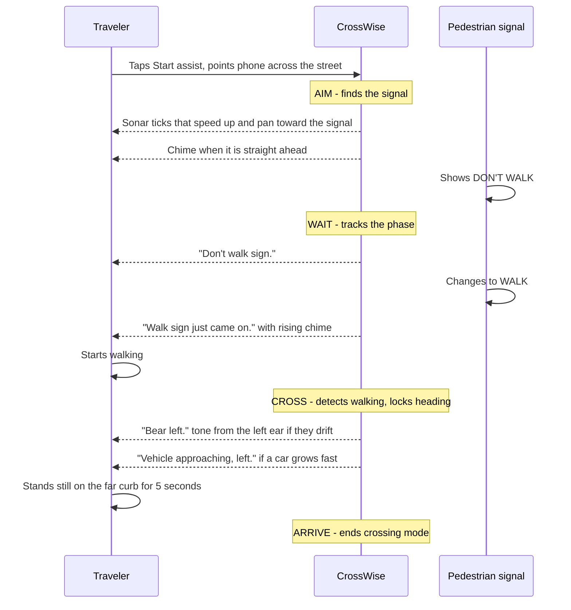
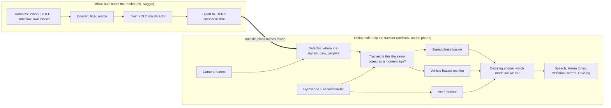
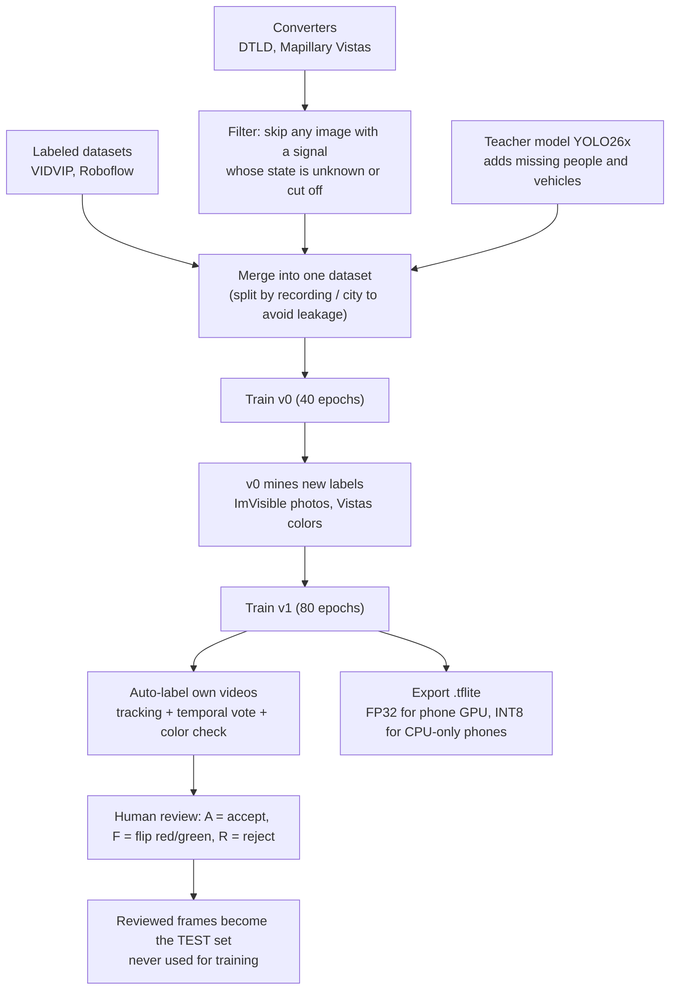
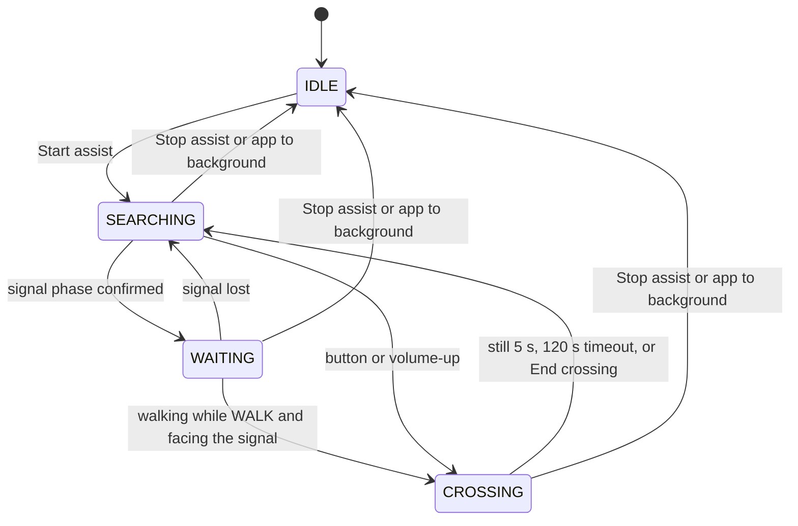
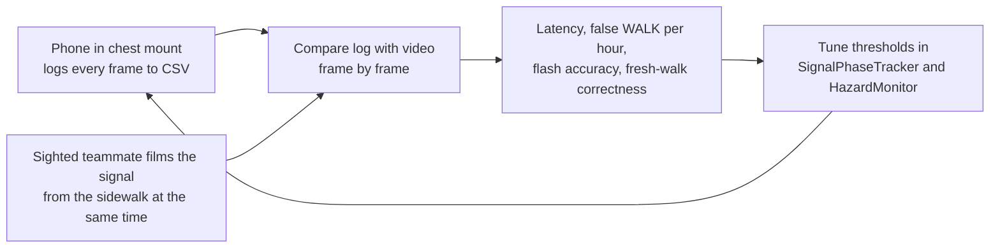
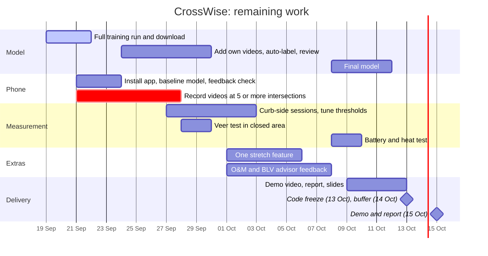

# CrossWise: A Phase-Aware, On-Device Street-Crossing Assistant for Blind and Low-Vision Pedestrians

**Research plan and methodology** · Capstone project · Started 17 Sep 2026 · Code freeze 13 Oct 2026 · Demo and report 15 Oct 2026
Written 19 Sep 2026 from the repository (code, `docs/`, `ml/`, `NEXT_STEPS.md`) and the files on disk.

> **How to read this document.** It is one story, top to bottom: *the problem → why the obvious solutions fall short → what
> CrossWise does → how it is built and why each tool was chosen → what it cannot do → how we will prove it works → what is
> left to do.* Every technical term is explained the first time it appears. Diagrams are drawn as Mermaid (they render on
> GitHub and in most Markdown viewers) or as plain-text sketches.

---

## Abstract

A blind or low-vision person who wants to cross a signalized street needs to know one thing that only eyes can provide:
*what is the pedestrian signal showing, and did it just change?* CrossWise is an Android app that answers this on the phone
itself, with no internet. It finds the signal with the camera, follows it **over time** rather than one photo at a time,
announces the change in short speech and tones, keeps the user walking straight with the gyroscope, and warns when a vehicle
is getting rapidly closer. It is trained without anyone drawing boxes by hand, and it is honest about its limits: it
*describes* what it sees and never says "safe to cross". This document explains the problem, the design choices and the
reasons for them, the boundaries of the product, the evaluation plan, and the steps left before the 15 Oct 2026 demo.

---

## 1. The problem

### 1.1 What crossing looks like without sight

At a signalized intersection, a **pedestrian signal** (the small box on the far side of the road) shows one of three things:

| What the signal shows | Name used here | Meaning |
|---|---|---|
| Green walking figure (or white, depending on country) | **WALK** | Pedestrians may start crossing |
| Red standing figure or hand | **DON'T WALK** | Do not start |
| Figure that blinks on and off | **flashing clearance** | The phase is ending; finish crossing, do not start |

A sighted person reads this at a glance. A blind or low-vision (**BLV**) person usually cannot, so they use a *substitute
cue*: they listen for the **surge of parallel traffic** (cars beside them starting to move) and go with it. That cue is
unreliable. Two examples:

* **Right-turn-on-red:** cars beside you may be moving while your signal still says DON'T WALK, or stopped while it says WALK.
* **Leading pedestrian interval (LPI):** the pedestrian signal turns to WALK a few seconds *before* the cars beside you move,
  so there is no surge to hear.

Some intersections have an **accessible pedestrian signal (APS)** that beeps or speaks, but most do not.
Aids built for sighted people also fail this group: **countdown timers** (numbers that count the seconds left) were essentially
unreadable for participants with severe visual impairment (Scott et al. 2012). And while crossing, people **veer** —
drift sideways out of the crosswalk — which vibration or audio feedback has been shown to reduce (Guth et al. 2017;
StreetNav, 2024).

### 1.2 What must be solved

Four things, in order of the crossing itself:

1. **Find** the signal (a phone camera must be pointed at it, and a blind user cannot see where it points).
2. **Read the phase and its timing** (what it shows, and *when it changed*).
3. **Stay straight** while crossing.
4. **Notice vehicles** coming toward you.

The rest of this document is the design for these four things.

---

## 2. Why the obvious solutions fall short, and what we chose

### 2.1 What already exists

| Product / system | What it does | Gap |
|---|---|---|
| **OKO** (AYES, Belgium) | Detects pedestrian signals with audio/haptic feedback; warns about veering | iPhone only, closed source. Users report no "tilt up" cue when the signal leaves the camera view near the far curb |
| **Ampel-Pilot** (Germany) | Red/green signal detection on iOS and Android | Old model generation; its dataset links are dead (checked 17 Sep 2026) |
| **Google Guided Vision** (Gemini) | Describes what the camera sees | Google states it is *not* a mobility aid |
| **Soundscape** | 3D-audio map callouts | No signal or vehicle detection |
| **PedApp / Signalyst** | Push-button or timing from city hardware | Only where the city installed compatible equipment |
| Academic apps (Ismail & Mousa 2025; VisionAid 2026; Cross-Assist 2024) | Detect red/green per camera frame; some detect vehicles | Judge **one frame at a time**; the closest one needs *two separate apps* and the user must switch by hand |

### 2.2 The design fork

Four ways to attack the problem were considered.

| Option | Why not (or why yes) |
|---|---|
| **A. Depend on smart infrastructure** (APS, PedApp) | Works only where cities installed it. Most intersections have nothing. |
| **B. Ask a cloud AI** ("what does the signal say?") | Needs internet and has delay; general vision-language models misread simple visual details ("VLMs are blind", 2024) and can invent answers, which is unacceptable when the answer decides a crossing. |
| **C. Classify each camera frame** (red or green, then speak) | This is what most prototypes do. One misread frame becomes a wrong announcement, and a single frame cannot tell *when* the sign changed, which is exactly the cue O&M instructors teach. |
| **D. On-device detector + reasoning over time** ✅ chosen | Runs offline, no images leave the phone, and remembering the last few seconds lets us filter flicker, time the change, and spot flashing. |

### 2.3 What CrossWise adds (its claim to novelty)

Compared with everything surveyed, CrossWise is the only one that combines: **Android + on-device + open source**;
**phase-aware** tracking (not per-frame); **the whole crossing in one app** with automatic mode changes; **vehicle alerts from
image growth** instead of a depth network; and a **gyroscope veer guard**.

### 2.4 Five principles that shape every decision

1. **Describe, never decide.** The app says "Walk sign just came on", never "safe to cross". The traveler's own skills
   (cane, guide dog, **O&M** = *orientation and mobility* training) stay in charge.
2. **A late WALK beats a false WALK.** Thresholds are deliberately asymmetric: announcing WALK needs more evidence than
   announcing DON'T WALK, because a wrong WALK can hurt someone and a late one costs a second.
3. **Silence is information.** Speak only on change; use short tones and vibration for continuous guidance, because a
   constantly talking assistant overloads the ears the user needs for traffic (Zhao et al. 2026).
4. **On-device and offline.** No network is needed at the curb.
5. **Honest uncertainty.** If the app is guessing (e.g. the basic model cannot verify colors), it says so; if it loses the
   signal, it says "Signal lost" instead of keeping a stale answer.

---

## 3. What CrossWise does: one crossing, start to finish

The app has four phases, which it switches between automatically. The diagram is one real crossing:



Terms in this diagram:

* **Sonar tick** — a short beep repeated like a submarine's ping. The closer the signal is to the center of the camera view,
  the faster the beeps (from one every 0.9 s down to one every 0.18 s), and the beep is **panned** (louder in one ear) toward
  the side where the signal is.
* **Earcon** — a short designed sound that means one thing (rising chime = WALK, low tone = DON'T WALK), the audio version
  of an icon.
* **Haptic** — vibration patterns from the phone (three strong pulses = WALK; one long pulse = DON'T WALK).
* **Fresh vs unknown-age WALK** — "just came on" is only said if the app *watched* DON'T WALK change to WALK. If the user
  arrives while WALK is already showing, the app says "Walk sign is on, but it may end soon", because it does not know how
  much time is left. This follows the O&M technique of starting at the *onset* of the walk interval.
* **Hands-free** — volume-up starts/ends crossing mode and volume-down repeats the current status; the phone can hang on a
  chest mount, and bone-conduction headphones keep the ears open to traffic.

### 3.1 What the user hears

| Event | Speech | Tone | Vibration |
|---|---|---|---|
| Walk just began | "Walk sign just came on." | rising 3-note chime | 3 strong pulses |
| Walk, age unknown | "Walk sign is on, but it may end soon." | – | 3 strong pulses |
| Flashing | "Walk sign flashing." | – | 3 light pulses |
| Don't walk | "Don't walk sign." | low 440 Hz tone | 1 long pulse |
| Signal lost | "Signal lost." (+ "tilt the phone up" if it left the top of the view) | falling 2-note | 2 light pulses |
| Drifting | "Bear left." / "Bear right." | 660 Hz from that ear | short-long / long-short |
| Vehicle | "Vehicle approaching, left." / "Vehicle close, left." | 2-tone alarm from that side | 4 short / 2 long |

Speech has four priority levels; urgent messages interrupt lesser ones, and stale low-priority messages are dropped rather
than queued, so the user never hears advice that is already out of date.

---

## 4. How it is built, and why each tool was chosen

### 4.1 The big picture

The project has two halves joined by a single file. The **offline half** (Python, run on a free cloud GPU) teaches a model to
see and saves it as a `.tflite` file. The **online half** (Android, Kotlin) loads that file and turns what the camera sees
into guidance.



Because the app finds classes **by name** in the model file (`ped_red, ped_green, crosswalk, person, bicycle, car,
motorcycle, bus, truck`), a newly trained model can be dropped in with no app changes. Everything after the detector is plain
Kotlin with no Android dependencies, so it can be unit-tested on a laptop. (Size: about 4,200 lines of app code with 45 unit
tests; about 3,400 lines of Python with 53 tests.)

### 4.2 The technology, and the reason for each choice

Terms first: an **object detector** is a neural network that looks at an image and returns **bounding boxes** (rectangles)
each labeled with a class and a confidence score. **Inference** means running a trained model on new input; **on-device**
means it happens on the phone. **FPS** is frames processed per second; **latency** is the delay between something happening
and the app reacting.

**On the phone**

| Technology | Job | Why this one |
|---|---|---|
| **Kotlin** (+ coroutines for background work) | All app logic | Standard Android language; pure-Kotlin logic is testable without a phone |
| **Jetpack Compose** | Screens (status, settings, safety notice) | Makes screen-reader support simple: **TalkBack** (Android's screen reader) can read a merged status panel, and large high-contrast phase colors serve low-vision users |
| **CameraX** | Camera frames + lens data | Handles differences between phone models; supplies the lens's **field of view** (how wide an angle the camera sees, about 40° horizontally in portrait) needed for aiming |
| **LiteRT** (Google's on-device model runtime, formerly TensorFlow Lite) | Runs the detector | Tries the phone's **GPU** first for speed, then falls back to the **CPU** so weaker phones still work; needs no network |
| **Gyroscope + accelerometer** (`GAME_ROTATION_VECTOR`) | Where the phone points; whether the user is walking | Deliberately **no compass**: metal, cars and buildings disturb magnetometers |
| **Text-to-speech, tone synthesis, vibration** | Output | Distinct sound and vibration per event; left/right panning carries direction without words |
| **CSV session log** | Records every analyzed frame (phase, evidence, FPS, speech) | Turns field tests into measurements (Section 8) |

**On the training side**

| Technology | Job | Why this one |
|---|---|---|
| **YOLO26n** (Ultralytics, Jan 2026) | The detector | Small (2.4 M parameters), and it outputs finished boxes with no post-processing. The "NMS-free" head means it does not need **non-maximum suppression** (the step that removes duplicate overlapping boxes), so decoding on the phone is simpler and faster. AGPL-3.0 license, so the project stays open source |
| **YOLO26x** (large) + **YOLOE** | *Teachers* | A bigger model labels people and vehicles that signal datasets forgot to label; YOLOE (open-vocabulary, text-prompted) gives a second opinion on missed signals. Never used to decide red vs green |
| **PyTorch** via Ultralytics | Training | Standard, with the LiteRT export built in |
| **Kaggle notebooks** | Free GPU (about 30 h/week) | The LiteRT exporter only runs on Linux/macOS, and this laptop is Windows. `kaggle_run.py` uploads the code, runs the notebook remotely and downloads the results, so no browser is needed |
| **OpenCV** | Video frames, color checks | Standard image tooling |
| **Roboflow SDK** | Downloads community datasets | Quick source of labeled signals (each set is inspected first: two of three tried were rejected) |
| **pytest** | Tests the data pipeline on synthetic data in each dataset's real format | Finds bugs without a GPU or the real data |

**The datasets**

| Dataset | Role | Why |
|---|---|---|
| **VIDVIP** (Japan, sidewalk, eye level) | **Main source** — 30,471 images; 3,520 contain a pedestrian signal (2,071 red, 1,510 green) | Same viewpoint as the app. Converted to 9,753 usable images |
| **DTLD** (Germany, car windscreen) | Second opinion: another country and camera; vehicle lights as negatives | Small yield (193 images) because unknown-state boxes are skipped on purpose (Section 5) |
| **Roboflow** "pedestrian-traffic-light" (Europe) | 887 usable images | Its green-heavy mix cancels VIDVIP's red-heavy mix: 2,460 red vs 2,463 green overall |
| **Mapillary Vistas, ImVisible** | Worldwide signal designs; image-level phase labels | Diversity, and a benchmark comparable with prior work (LYTNet) |
| **Own recordings** | **Test set only** | The one honest test of *this* city, phone and signal design |

---

## 5. Teaching the phone to see: data methodology

The model must learn "what red vs green pedestrian signals look like". The plan uses **no hand-drawn boxes**; labels come
from four kinds of source: (1) existing labeled datasets, (2) automatic conversion of other formats, (3) a **teacher model**
that adds boxes for people and vehicles, and (4) auto-labeled videos that a human only accepts or rejects.



Rules and terms that make this safe:

* **Never teach a lit signal as background.** If an image contains a visible signal whose color is unknown, the image is
  *skipped*, not left unlabeled. Otherwise the model would learn "an illuminated signal is nothing", the one mistake this
  project cannot make. About 2,400 of DTLD's pedestrian-light boxes have an unknown state, which (together with its tiny
  signals) is why only 193 of its images were usable; the same rule dropped 39 Roboflow images.
* **Hard negatives.** Traffic lights for *cars* (round lights, arrows) are deliberately left unlabeled so the model learns
  they are *not* pedestrian signals.
* **Pseudo-label** — a label created by a model instead of a person. Ours are logged one by one (`pseudo_labels.csv`) and are
  never applied to test data.
* **Scale matching.** A car-mounted dataset shows signals tiny and far away. Images are cropped around the signals so they
  end up about 24 pixels tall, similar to what a phone sees at the curb.
* **Temporal voting.** In video, a real signal does not flicker red/green between frames, so an auto-label that flips
  frame-to-frame is flagged for review.
* **Leakage** — when the same scene is in both training and test data, which makes scores look better than reality.
  Prevented by splitting per recording (VIDVIP), per city (DTLD), and keeping the researcher's own videos test-only.
* **No hue augmentation.** Training normally randomly alters image colors to add variety. Here color *is* the answer, so hue
  changes are turned off (a red altered toward orange or green would be a wrong label).
* **v0 → v1.** A quick first model (v0) is used to help label more data, then a longer second run (v1) trains on it.
* **FP32 vs INT8** — numbers stored in 32-bit floating point (most accurate; used on phone GPUs) vs 8-bit integers (smaller
  and faster on CPUs, slightly less accurate).

**How accuracy is scored.** **mAP** (mean average precision) measures how well predicted boxes match true boxes: a
prediction counts as right if it overlaps the true box enough, and **mAP50** requires at least 50% overlap while **mAP50-95**
averages stricter thresholds up to 95%. mAP averages over all mistakes equally, but for this app one mistake is worse than the
rest, so every model also reports a **red-called-green rate**: out of all true red signals, the share the model labeled
green (with raw counts, since with a small test set one box can make a scary-looking percentage).

---

## 6. Making sense over time: the reasoning layer

A detector answers "what is in *this* frame?". The traveler needs "what phase is the signal in *now*, and how old is it?".
Four small modules add memory.

### 6.1 Signal phase tracker: ignoring flicker, timing the change

The tracker keeps a running **evidence** score for WALK and for DON'T WALK. Each frame nudges the score, and old frames fade
(a **leaky integrator**: `e ← d·e + (1−d)·score`, with `d = exp(−Δt / 450 ms)`, which makes it behave the same at 10 or 30 FPS).
It then decides using **asymmetric dwell**: the evidence must stay strong for 700 ms before WALK is announced, but only 300 ms
before DON'T WALK.

A constructed example (each character is 0.1 s of the detector's raw per-frame guess; R = red, G = green):

```
Real signal:      RRRRRRRRRRRRRRRRRRRR GGGGGGGGGGGGGGGGGGGG      (turns green at 2.0 s)
Detector guess:   RRRRRGGGRRRRRRRRRRRR GGGGGGGGGGGGGGGGGGGG      (misreads 3 frames as G at 0.5 s)
                       ^^^ 0.3 s blip
Per-frame app:    says "WALK" at 0.5 s   <-- false WALK, dangerous
CrossWise:        blip lasts 0.3 s < 0.7 s dwell -> ignored
                  says "Walk sign just came on" about 1.2 s after the real change (design value)
```

The blip case is covered by a unit test (`briefGreenBlipDuringRedIsIgnored`); the ~1.2 s and ~0.8 s latencies are design
values from synthetic tests and will be **measured** in the field study (Section 8).

**Flashing** is recognized from rhythm, not color: over the last 4 s, the signal must have at least two complete "visible"
runs and two "invisible" runs, each between 0.18 and 1.3 s long and reasonably regular (coefficient of variation ≤ 0.45,
i.e. the spread of run lengths is under 45% of their average). Random single-frame misses look nothing like this, and a bus
hiding the signal produces one long gap instead of a rhythm.

**Fresh WALK** is defined in Section 3. The signal is **lost** after 1.8 s without seeing it; this is not announced mid-crossing,
because the far signal naturally leaves the camera view.

### 6.2 Vehicle hazards: reading approach from image growth

An object coming straight at you appears to *grow*. Optical **time-to-contact** (τ, "tau", Lee 1976) is the time until it
would reach you if nothing changes, and it can be computed from growth alone, with no depth sensor:

`τ = size ÷ (how fast size is growing)` (the app fits a line through the log of the box size over the last second).

```
Vehicle A, driving toward you            Vehicle B, driving across your view
box height: 100 px -> 125 px in 0.5 s    box height: 100 px -> 101 px in 0.5 s
growth rate = ln(125/100) / 0.5 = 0.45/s growth rate = ln(101/100) / 0.5 = 0.02/s
tau = 1 / 0.45 = 2.2 s  (<= 3 s)         tau = 1 / 0.02 = 50 s
=> "Vehicle approaching, left."          => silent
```

The alert fires if the fit is clean (R² ≥ 0.6), the vehicle fills at least 5% of the frame height, and τ ≤ 3 s (4 s while
crossing); τ ≤ 1.6 s is "critical" ("Vehicle close"). Windows where the box touches the frame edge are skipped, because
growth there is a car *entering* the view, not approaching. A depth network was rejected: it doubled latency in prior work
and looming already gives what matters.

### 6.3 Heading, aiming and the veer guard

The **gyroscope** measures how fast the phone rotates; with the accelerometer it gives the camera's **heading** (compass
direction it faces) and **pitch** (up-down tilt). Two uses:

* **Gyro-compensated tracking.** When the user turns the phone, everything in the image shifts. The tracker subtracts the
  measured rotation so a small distant signal keeps its identity while the user scans for it. Pitch below −35° for 1.5 s (phone
  pointing at the ground) triggers "Tilt the phone up", the cue OKO users say is missing.
* **Veer guard.** When crossing starts, the app locks the average heading of the last second as "straight". If the heading
  drifts by 12° or more for 1 s, it says "Bear left/right" from the matching ear. Ordinary body sway (about ±15° at step rate)
  is smoothed away and does not trigger it.

**Lateral error** is how far sideways you end up from the line you intended to walk, measured at right angles to that line.
A small heading error becomes a large sideways error over a crossing:

```
Top view: walking 15 m along a taped line.
 start                                                  finish
   o ================ intended path ====================== o
    \                                                       ^
     \_____                                                 | lateral error
           \______  actual path                             | (measured at right angles
                  \________                                 |  to the intended line)
                           \_______________________________ x

 Heading error kept for the whole walk:   4° -> 15 m x tan(4°)  = 1.0 m sideways
                                         12° -> 15 m x tan(12°) = 3.2 m sideways
```

This is why 12° is the alert threshold: past it, the sideways error grows toward several meters. The field test measures
lateral error at 15 m with and without guidance.

### 6.4 The mode state machine

The **crossing engine** decides which of the four phases applies, using a **state machine** (a set of named states with
rules for moving between them):



If the user walks while the signal shows DON'T WALK (and faces it), the app says "Caution, the signal shows don't walk" once
per red phase. After each crossing the signal memory is reset, because the next crossing uses a different signal. When the
app is sent to the background the camera stops, so assist stops *and says so* instead of continuing with stale information.

---

## 7. What it can do, and what it cannot

The product's honesty about its limits is a design feature, not a footnote.

| It **can** | It **cannot** | Why the boundary |
|---|---|---|
| Announce WALK, DON'T WALK, flashing, and whether a WALK was seen starting | Say a crossing is **safe** | Describe-never-decide principle; it cannot see everything a safe crossing depends on |
| Guide the camera toward the signal, and hint "tilt up" | Read **countdown digits** | No dataset has digit-level labels and reading LED digits is unreliable |
| Warn of a vehicle rapidly approaching | Judge **gaps in traffic** at unsignalized crossings, or measure vehicle speed and distance | Needs all lanes in view with metric depth; a phone sees about 40° horizontally, so side traffic is seen only when the user scans |
| Nudge the user back when they drift by 12° or more | Steer to the *crosswalk's* direction (it keeps the user's own start heading) | Aligning to the stripes is a candidate stretch feature |
| Work offline, keep images on the phone | Work with the screen off or in the background | Would need a camera foreground service and battery work; today assist stops when the app is backgrounded |
| Report "Signal lost" honestly | Work reliably in heavy rain, night glare or when a bus blocks the signal | The detector's accuracy drops; it reports loss instead of guessing |
| Run on Android 8.0+ (minSdk 26) in portrait | Run on iPhone, or use smart-glasses cameras | iOS and glasses (Meta Wearables toolkit, developer preview) are out of one person-month scope |
| Give general help (signals, crosswalks, people, vehicles) | Describe a scene in words ("there is a bakery on the corner") | Google's Guided Vision already covers scene description; streaming vision-language models are too slow and unreliable for crossing decisions |

**Also out of scope for this project:** street trials with BLV participants (they need ethics approval and O&M supervision);
a crowdsourced intersection database; Wear OS haptics and OpenStreetMap "pre-briefs" unless chosen as the week-3 extra.

> ⚠️ CrossWise is a research prototype and an *aid*, not a replacement for a cane, a guide dog or O&M training.

---

## 8. How we will know it works

### 8.1 Research questions

| # | Question | Measured by |
|---|---|---|
| RQ1 | Can a small detector, trained without hand-drawn boxes, read signal state on a phone reliably, and how often does it read red as green? | mAP per class, red-called-green rate |
| RQ2 | Does tracking phase over time cut false WALK announcements compared with deciding frame by frame? | false WALK per hour, latency |
| RQ3 | Can vehicle approach be detected from image growth alone? | alerts for approaching vs passing vehicles |
| RQ4 | Does gyroscope drift feedback reduce sideways error? | lateral error at 15 m, with vs without |
| RQ5 | Can the whole task run in one app, on-device, at a usable speed and battery cost? | FPS, battery, heat |

### 8.2 Metrics, defined

| Metric | What it means, with an example | Where it comes from |
|---|---|---|
| **mAP50 / mAP50-95** per class | Box accuracy (Section 5) | Model report on the local test set |
| **Red-called-green rate** | If 100 red signals appear and 3 are labeled green: 3%. Target: as close to 0 as possible | Model report (with raw counts) |
| **Image-level phase accuracy** | Share of photos whose overall signal phase is right, compared with LYTNet on the ImVisible test set | `eval_imvisible.py` |
| **Auto-label precision** | Of 300 auto-labeled frames reviewed, 270 accepted unchanged = 90% | `review_summary.json` |
| **Announcement latency** | Seconds between the real change (seen in video) and the app's announcement | Log vs video |
| **False WALK per hour** | Times the app said WALK when the signal was not WALK. **Target: 0** | All sessions, log vs video |
| **Flash detection precision / recall** | Precision: of the "flashing" announcements, how many were real. Recall: of the real flashing phases, how many were caught | Log vs video |
| **False alarms per minute** | Vehicle alerts for cars that were not approaching | Recorded curb sessions |
| **Lateral error at 15 m** | Sideways distance from the taped line at the end of a 15 m walk (Section 6.3) | Closed-area test |
| **FPS / inference ms / battery % per 20 min / temperature** | Speed, per-frame model time, energy use, heat | Two phones (one mid-range) |
| **SUS** (System Usability Scale) | A standard 10-question usability score; plus comments on wording and tones | O&M instructor / BLV advisors at a table |

### 8.3 Study design



**Planned analysis for RQ2 (proposed, not yet built):** replay each recorded video through the detector twice, once treating
each frame's color as the decision and once through the phase tracker, and compare false-WALK counts and latency on identical
input. This separates the benefit of temporal reasoning from the detector's own accuracy.

### 8.4 Safety and ethics

* Nobody crosses a real street blindfolded or lets the app decide. Street sessions happen **on the sidewalk**, and no one
  steps into the road because of an app message.
* Veer tests happen only in closed areas (empty parking lot) with a sighted spotter.
* Film traffic, not faces; blur faces before sharing; keep raw video private.
* Interviews and table demos may need university ethics approval (to be confirmed).
* **Licenses.** VIDVIP (CC BY-NC-ND 4.0: non-commercial, no redistribution) and DTLD (research and teaching) stay private,
  including on Kaggle. Ultralytics YOLO is AGPL-3.0, so this repository stays open source.

---

## 9. Work plan: what is done and what is left

### 9.1 Status on 19 Sep 2026 (verified from the repository)

| Area | State |
|---|---|
| Android app: camera, detector, tracker, phase tracker, hazards, heading, veer guard, modes, feedback, settings, logging | Built; 45 JVM tests |
| ML pipeline: converters, merge, pseudo-labels, mining, training, export, evaluation, Kaggle runner | Built; 53 tests; smoke run **complete** |
| Datasets: VIDVIP and DTLD converted; Roboflow vetted (1 of 3 kept); three private Kaggle datasets uploaded | Done |
| Baseline `yolo26n.tflite` (generic COCO model) and a smoke-test model | On disk (`ml/kaggle_output/artifacts/`) |
| **Full training run** (`crosswise-full`, 40 + 80 epochs) | **Running** on Kaggle when this was written |
| Test on a real phone or street; own recordings; reviewed test set; field measurements; report | **Not started** |

The *smoke run* is a full rehearsal on synthetic (fake) images. Its mAP50 of 0.995 proves the pipeline works from end to end;
it says nothing about real-world accuracy.

### 9.2 Schedule



### 9.3 Steps

1. **Get the real model onto a phone.** Download the finished run (`python scripts/kaggle_run.py output`). If it failed for
   lack of a GPU, verify the Kaggle account by phone and re-run. Import the generic baseline first, then
   `crosswise_v1_best.tflite` (*Settings → Import .tflite model*); check FPS, GPU vs CPU, speech, tones, vibration, volume keys.
2. **Record your own video** from the sidewalk: at least 5 intersections, full red → green → flashing → red cycles, day and night
   (rain if possible), turning vehicles. *This is the longest lead item and does not depend on the model, so start now.*
3. **Turn recordings into a test set:** upload as a private dataset, let the model auto-label, then review every frame
   (about 15 minutes per 300 frames with the A/F/R keys). Report auto-label precision.
4. **Score the model** on the reviewed test set and on ImVisible; record the red-called-green rate.
5. **Curb-side sessions** with logging on and a teammate filming; compare log with video; tune thresholds.
6. **Veer test** on a taped 15 m line with a sighted spotter, with and without guidance.
7. **One stretch feature** (by value/effort): OpenStreetMap pre-brief (~2 days, e.g. "Signalized crossing ahead, with island"),
   siren alerts (~1 day), Wear OS wrist haptics (~2 days), or crosswalk-stripe alignment (~3 days, riskier).
8. **Advisor feedback:** an O&M instructor and, if possible, 2–5 BLV advisors, about wording, tones and vibration (table demos only).
9. **Finish:** final model and metrics table, 20-minute battery/heat test, demo video with captions, report, slides.
   Code freeze **Tue 13 Oct**, buffer **Wed 14 Oct**, demo **Thu 15 Oct**.

### 9.4 Main risks

| Risk | Mitigation |
|---|---|
| Training data are mostly Japanese sidewalks, so local signals may look different (**domain shift**) and red could be read as green | Report red-called-green explicitly; use asymmetric thresholds; test on own recordings; state the limit in the report |
| Too little or unbalanced data | Combine sources; Roboflow offsets VIDVIP's red skew; report per-class results |
| Kaggle needs phone verification or hits its weekly quota | Verify early; the current run uses about 4 of 30 GPU-hours |
| App too slow or hot on a mid-range phone | GPU first with CPU fallback; INT8 export; test on a mid-range phone in week 1 |
| Night, rain or glare defeat detection | The app says "Signal lost"; include such conditions in recordings and report failure rates |
| Short field-test time | Start recording now; log every session |
| Scope creep | At most one or two extras; the rest stays in Section 7 |

### 9.5 Validity limits of the study

* Latency and false-alarm numbers come from a **sighted observer** comparing logs to video, not from a BLV traveler making
  real decisions. The study can show measurable perception and timing behavior; it **cannot** claim improved safety or
  independence.
* One researcher's recordings from one city will not cover all signal designs.
* Auto-labels can be wrong; this is limited by reviewing every test frame and reporting auto-label precision.

---

## 10. References

Carried over from `docs/RESEARCH.md` (compiled September 2026). Links were **not re-verified** for this document; check each
before citing formally.

1. OKO — https://apps.apple.com/us/app/oko-cross-streets-and-maps/id1583614988
2. Ampel-Pilot — https://play.google.com/store/apps/details?id=org.tensorflow.ampelpilot
3. Google Guided Vision — https://www.accessibility.org.au/google-introduces-guided-vision-for-blind-and-low-vision-android-users
4. Soundscape (Scottish Tech Army) — https://www.scottishtecharmy.org/soundscape
5. Ismail & Mousa, AAAI Summer Symposium 2025 — https://ojs.aaai.org/index.php/AAAI-SS/article/download/36057/38212
6. VisionAid, CHI 2026 Extended Abstracts — https://dl.acm.org/doi/10.1145/3772363.3798801
7. Cross-Assist, 2024 — https://dergipark.org.tr/en/pub/tjse/issue/88689/1447019
8. LYTNet / ImVisible, 2019 — https://arxiv.org/abs/1907.09706
9. StreetNav (Columbia, UIST 2024) — https://arxiv.org/abs/2310.00491
10. Scott et al. 2012, countdown displays — https://doi.org/10.3141/2299-07
11. Guth et al. 2017, veering — https://doi.org/10.3141/2661-05
12. Zhao et al. 2026, streaming assistants — https://arxiv.org/abs/2511.00945
13. "VLMs are blind", 2024 — https://arxiv.org/abs/2407.06581
14. Ultralytics YOLO26 — https://docs.ultralytics.com/models/yolo26/ ; YOLOE — https://docs.ultralytics.com/models/yoloe/
15. LiteRT on Android — https://developers.google.com/edge/litert/android
16. VIDVIP — https://github.com/TetsuakiBaba/VIDVIP ; DTLD — https://www.uni-ulm.de/en/in/institute-of-measurement-control-and-microtechnology/research/data-sets/driveu-traffic-light-dataset/ ; Mapillary Vistas — https://www.mapillary.com/dataset/vistas
17. Lee, D. N. 1976, "A theory of visual control of braking based on information about time-to-collision", *Perception* 5(4).
18. Accessible pedestrian signals and the walk-onset cue — http://www.apsguide.org/appendix_d_understanding.cfm
